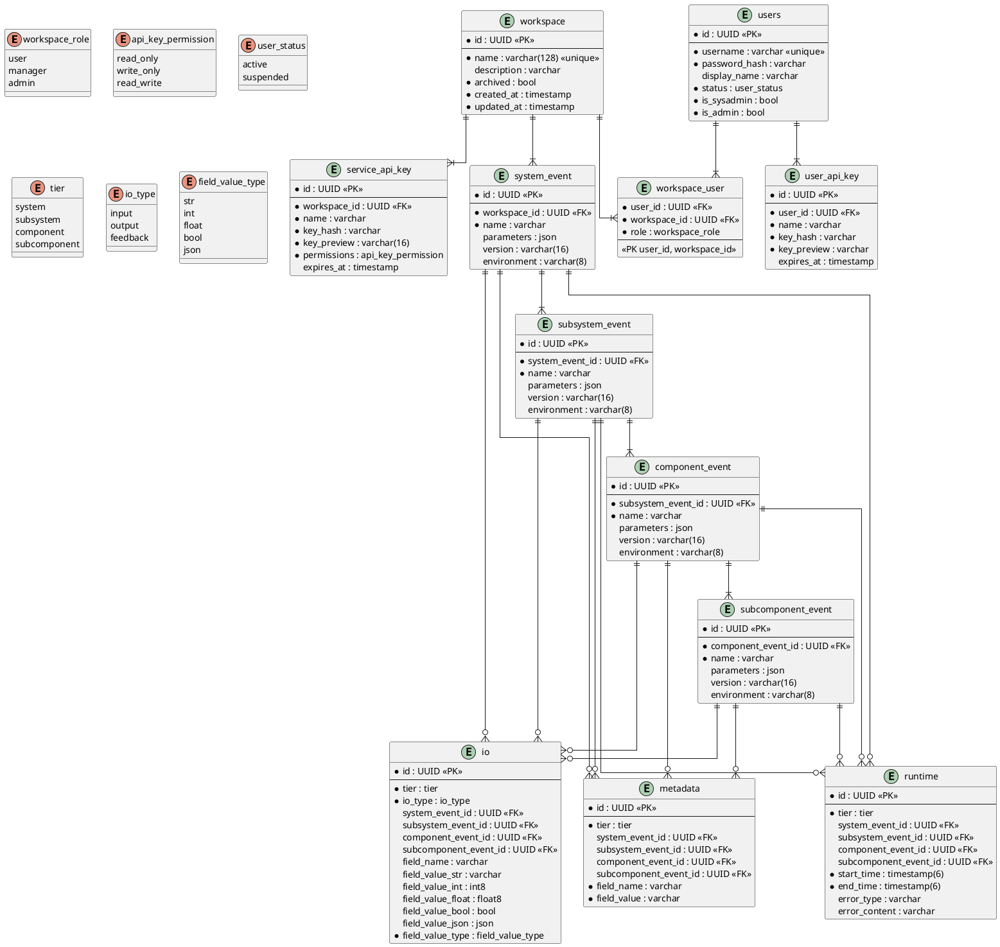

# Database Schema

```puml
@startuml DatabaseSchema

skinparam linetype ortho

' Enums
enum workspace_role {
    user
    manager
    admin
}

enum api_key_permission {
    read_only
    write_only
    read_write
}

enum user_status {
    active
    suspended
}

enum tier {
    system
    subsystem
    component
    subcomponent
}

enum io_type {
    input
    output
    feedback
}

enum field_value_type {
    str
    int
    float
    bool
    json
}

' Base tables
entity "workspace" as workspace {
    * id : UUID <<PK>>
    --
    * name : varchar(128) <<unique>>
    description : varchar
    * archived : bool
    * created_at : timestamp
    * updated_at : timestamp
}

entity "users" as users {
    * id : UUID <<PK>>
    --
    * username : varchar <<unique>>
    * password_hash : varchar
    display_name : varchar
    * status : user_status
    * is_sysadmin : bool
    * is_admin : bool
}

' Join and API key tables
entity "workspace_user" as workspace_user {
    * user_id : UUID <<FK>>
    * workspace_id : UUID <<FK>>
    * role : workspace_role
    --
    <<PK user_id, workspace_id>>
}

entity "user_api_key" as user_api_key {
    * id : UUID <<PK>>
    --
    * user_id : UUID <<FK>>
    * name : varchar
    * key_hash : varchar
    * key_preview : varchar
    expires_at : timestamp
}

entity "service_api_key" as service_api_key {
    * id : UUID <<PK>>
    --
    * workspace_id : UUID <<FK>>
    * name : varchar
    * key_hash : varchar
    * key_preview : varchar(16)
    * permissions : api_key_permission
    expires_at : timestamp
}

' Event hierarchy tables
entity "system_event" as system_event {
    * id : UUID <<PK>>
    --
    * workspace_id : UUID <<FK>>
    * name : varchar
    parameters : json
    version : varchar(16)
    environment : varchar(8)
}

entity "subsystem_event" as subsystem_event {
    * id : UUID <<PK>>
    --
    * system_event_id : UUID <<FK>>
    * name : varchar
    parameters : json
    version : varchar(16)
    environment : varchar(8)
}

entity "component_event" as component_event {
    * id : UUID <<PK>>
    --
    * subsystem_event_id : UUID <<FK>>
    * name : varchar
    parameters : json
    version : varchar(16)
    environment : varchar(8)
}

entity "subcomponent_event" as subcomponent_event {
    * id : UUID <<PK>>
    --
    * component_event_id : UUID <<FK>>
    * name : varchar
    parameters : json
    version : varchar(16)
    environment : varchar(8)
}

' Supporting tables
entity "runtime" as runtime {
    * id : UUID <<PK>>
    --
    * tier : tier
    system_event_id : UUID <<FK>>
    subsystem_event_id : UUID <<FK>>
    component_event_id : UUID <<FK>>
    subcomponent_event_id : UUID <<FK>>
    * start_time : timestamp(6)
    * end_time : timestamp(6)
    error_type : varchar
    error_content : varchar
}

entity "io" as io {
    * id : UUID <<PK>>
    --
    * tier : tier
    * io_type : io_type
    system_event_id : UUID <<FK>>
    subsystem_event_id : UUID <<FK>>
    component_event_id : UUID <<FK>>
    subcomponent_event_id : UUID <<FK>>
    field_name : varchar
    field_value_str : varchar
    field_value_int : int8
    field_value_float : float8
    field_value_bool : bool
    field_value_json : json
    * field_value_type : field_value_type
}

entity "metadata" as metadata {
    * id : UUID <<PK>>
    --
    * tier : tier
    system_event_id : UUID <<FK>>
    subsystem_event_id : UUID <<FK>>
    component_event_id : UUID <<FK>>
    subcomponent_event_id : UUID <<FK>>
    * field_name : varchar
    * field_value : varchar
}

' Relationships
workspace ||--|{ workspace_user
workspace ||--|{ service_api_key
workspace ||--|{ system_event

users ||--|{ workspace_user
users ||--|{ user_api_key

system_event ||--|{ subsystem_event
subsystem_event ||--|{ component_event
component_event ||--|{ subcomponent_event

system_event ||--o{ runtime
subsystem_event ||--o{ runtime
component_event ||--o{ runtime
subcomponent_event ||--o{ runtime

system_event ||--o{ io
subsystem_event ||--o{ io
component_event ||--o{ io
subcomponent_event ||--o{ io

system_event ||--o{ metadata
subsystem_event ||--o{ metadata
component_event ||--o{ metadata
subcomponent_event ||--o{ metadata
@enduml
```
